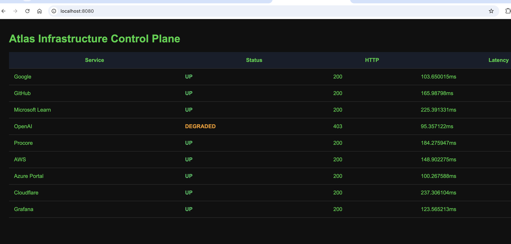

# Atlas

Atlas is a lightweight infrastructure control plane written in Go.

Atlas is designed to monitor, manage, and automate infrastructure through a simple, extensible platform inspired by modern Site Reliability Engineering (SRE) and Infrastructure Engineering practices.

<h1 align="center">Atlas</h1>

<p align="center">
  
  
</p>

---

## Current Features

- YAML-based service configuration
- HTTP health monitoring
- REST API for service status
- Web dashboard
- HTTP status code monitoring
- Latency measurements
- Service health visualization

---

## Roadmap

### Monitoring
- [x] YAML configuration
- [x] HTTP health checks
- [x] REST API
- [x] Web dashboard
- [ ] Concurrent health checks
- [ ] Auto-refresh dashboard
- [ ] Historical uptime tracking

### Observability
- [ ] Prometheus metrics
- [ ] Grafana integration
- [ ] Structured logging
- [ ] Alerting

### Infrastructure
- [ ] SSH server management
- [ ] Service restart capabilities
- [ ] Configuration management
- [ ] Deployment automation
- [ ] Infrastructure-as-Code engine

---

## Technology Stack

- Go
- HTML
- YAML
- Git

### Planned Integrations

- PostgreSQL
- Prometheus
- Grafana
- SQLite

---

## Project Structure

```
Atlas/
├── cmd/
├── internal/
│   ├── api/
│   ├── config/
│   └── health/
├── configs/
├── web/
│   └── templates/
└── screenshots/
```

---

## Why Atlas?

Atlas is my personal infrastructure engineering project focused on learning and applying:

- Go
- Backend Systems Engineering
- Site Reliability Engineering (SRE)
- Infrastructure Automation
- API Development
- Monitoring & Observability

Rather than building another CRUD application, Atlas focuses on solving real infrastructure problems through clean architecture, automation, and operational tooling.

---

## Future Vision

The long-term goal is to evolve Atlas into a lightweight infrastructure control plane capable of:

- Monitoring services and servers
- Managing Linux hosts
- Collecting metrics
- Deploying applications
- Executing infrastructure automation
- Providing a single operational dashboard